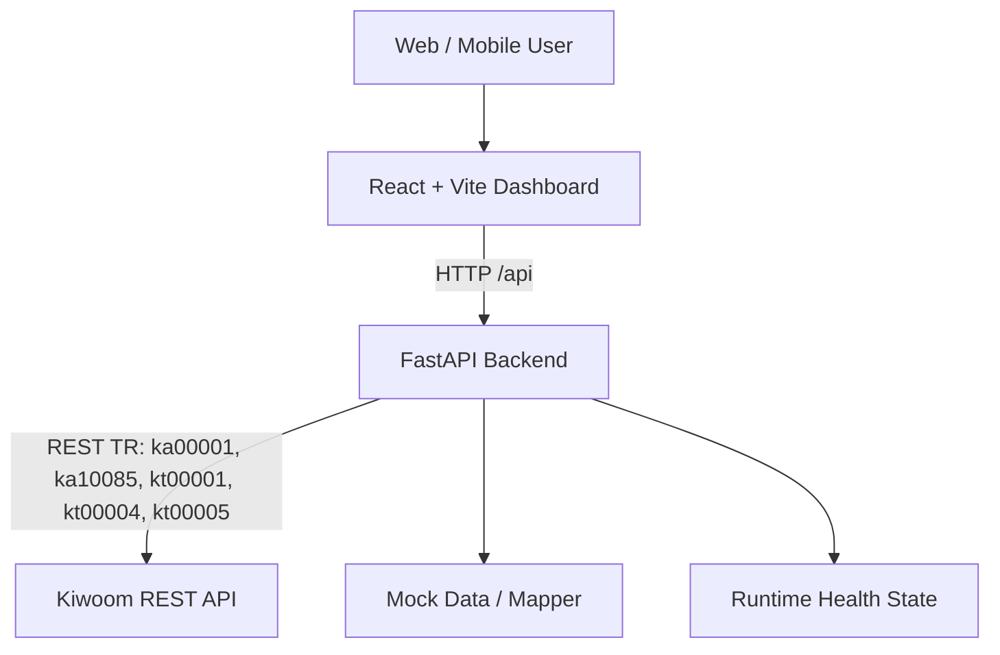
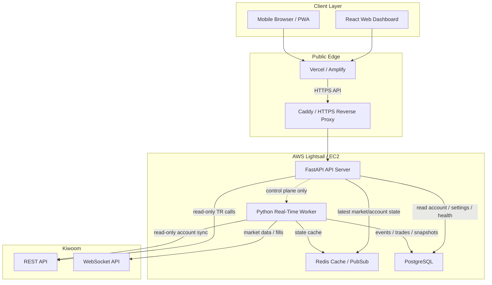
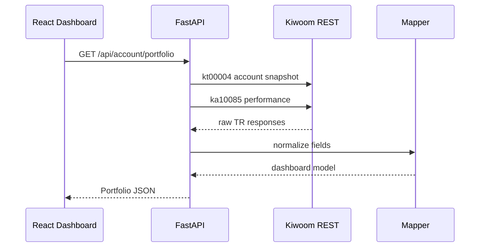
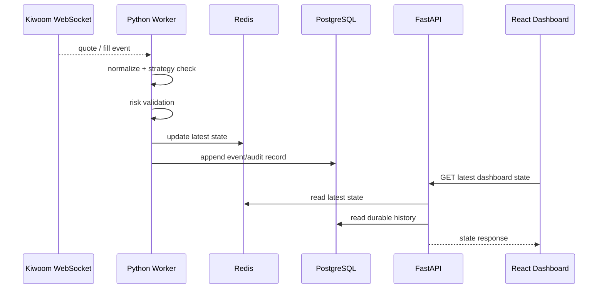

# Architecture

Strategy Pilot is split into a browser dashboard, backend API, and later a real-time trading worker. The current implementation focuses on read-only account and market lookup. Order execution is intentionally out of scope for this phase.

## Current Phase

Current backend APIs:

- `GET /api/health`
- `GET /api/accounts`
- `GET /api/account/portfolio`
- `GET /api/account/performance`
- `GET /api/account/cash`
- `GET /api/account/holdings`
- `GET /api/market/watchlist`

No order API is implemented.

## Target Production Architecture

## Component Responsibilities

### React

Responsibilities:

- Dashboard UI
- Portfolio, strategies, orders, market, settings screens
- API loading/error states
- Mobile/PWA experience

Non-responsibilities:

- Kiwoom credentials
- direct Kiwoom API calls
- strategy decision loop
- real order execution

The frontend calls only the internal backend API. Use `VITE_API_BASE_URL` for mobile/cloud deployments.

### FastAPI

Responsibilities:

- Read-only account and market HTTP APIs
- Health state
- Backend configuration validation
- Mock/live mode boundary
- Dashboard control-plane API

Current Kiwoom TR mappings:

- `/api/accounts` -> `ka00001`
- `/api/account/performance` -> `ka10085`
- `/api/account/cash` -> `kt00001`
- `/api/account/portfolio` -> `kt00004` + `ka10085`
- `/api/account/holdings` -> `kt00005` + `ka10085`
- `/api/market/watchlist` -> `ka10001`

FastAPI should not run a latency-sensitive trading loop. It should expose state and accept bounded control actions after risk validation is implemented.

### Python Worker

Planned responsibilities:

- Keep Kiwoom WebSocket connection alive
- Subscribe to real-time quotes/order/fill events
- Normalize market events
- Run strategy checks
- Apply risk checks
- Publish current state to Redis
- Persist events to PostgreSQL

The worker is the correct place for low-latency automated trading logic. React and normal HTTP request paths must not be in the critical trading loop.

### PostgreSQL

Planned responsibilities:

- accounts metadata
- holdings snapshots
- strategy definitions
- order intents
- fills
- trade journal
- daily PnL snapshots
- audit logs

PostgreSQL is the source of durable truth. Do not rely on Redis alone for records that must survive restarts.

### Redis

Planned responsibilities:

- latest quote cache
- latest account/position state cache
- worker heartbeat
- PubSub or queue for UI updates
- short-lived idempotency or lock keys

Redis should be treated as volatile fast state, not the durable trade ledger.

### Kiwoom REST API

Current use:

- account lookup
- performance lookup
- cash lookup
- holdings lookup
- stock info polling for watchlist

REST is suitable for account snapshots and slower control-plane reads. It is not sufficient for a high-speed market event loop by itself.

### Kiwoom WebSocket

Planned use:

- real-time quotes
- order/fill notifications if supported
- strategy trigger inputs

WebSocket handling should run in the Python worker, not in the React frontend.

## Data Flow

### Account Dashboard Load

### Future Real-Time Trading Flow

## Security Boundaries

- Kiwoom credentials live only in backend or worker runtime secrets.
- Frontend `.env` may contain only public API URL values such as `VITE_API_BASE_URL`.
- Full account numbers and tokens must be masked in logs.
- Live mode must be explicitly enabled with `KIWOOM_MODE=live`.
- Order execution requires a separate risk-controlled server-side adapter and is not part of the current phase.

## Performance Position

The current React + FastAPI + Python direction is appropriate if responsibilities remain separated:

- React is not part of latency-sensitive trading.
- FastAPI handles control-plane requests and read APIs.
- Python worker handles WebSocket event processing and strategy timing.
- Redis handles fast state sharing.
- PostgreSQL handles durable audit and history.

For later phases, performance review should focus on worker event latency, Kiwoom WebSocket stability, Redis round-trip time, and order adapter idempotency, not on React rendering speed.
