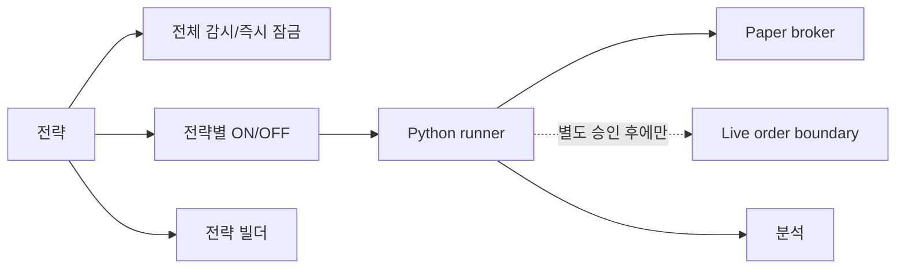

# Strategy Pilot V2 Dashboard Prototype Map

이 문서는 현재 대시보드의 화면 이동과 버튼 동작을 기준으로 새 버전의 정보 구조를 정리한다.

## 1. 하단 탭

| 순서 | 탭 | 경로 | 주 목적 | 핵심 데이터 |
| ---: | --- | --- | --- | --- |
| 1 | 홈 | `/` | 계좌와 자동매매 상태 요약 | 평가금액, 주문가능금액, 보유종목, 활성 전략 |
| 2 | 시세 | `/quotes` | 미국주식 후보와 차트 확인 | 등락률, 거래량, 캔들, 호가 |
| 3 | 전략 | `/strategies` | 전략 선택과 runner 상태 관리 | 전략별 ON/OFF, 조건 판정, 이벤트 |
| 4 | 분석 | `/analytics` | 전략 성과와 실패 이유 분석 | 실현손익, Paper 이벤트, 차단 로그 |
| 5 | 설정 | `/settings` | 리스크/알림/연결 설정 | 손실 한도, 투자 한도, 알림 |

`/orders`는 별도 탭이 아니며 현재 `/strategies`로 이동한다.

## 2. 버튼 이동/동작 표

| 시작 화면 | 버튼/영역 | 동작 | 이동/호출 대상 | V2 권장 |
| --- | --- | --- | --- | --- |
| 로그인 | 저장 프로필 선택 | 프로필 선택 | 선택 상태 유지 | 유지 |
| 로그인 | PIN 로그인 | CLI 프로필 세션 생성 | `/api/auth/kiwoom/profile-login` -> 홈 | 유지, 실패 원인 단순화 |
| 홈 | 전략 관리 | 전략 목록 열기 | `/strategies` | 유지 |
| 홈 | 보유종목 행 | 종목 시세 열기 | `/quotes?symbol={ticker}&exchange={code}` | 유지 |
| 시세 | 가격 급등락 | 등락률 순위 선택 | 미국 랭킹 API | 유지 |
| 시세 | 거래량 갱신 | 거래량 순위 선택 | 미국 랭킹 API | 유지 |
| 시세 | 종목 행 | 종목 선택/차트 갱신 | 종목 상태 + 차트 API | 유지 |
| 시세 | 분/일/주/월 | 차트 주기 변경 | `/api/market/us/chart/{timeframe}` | 유지 |
| 전략 | 전체 감시/즉시 잠금 | runner 전체 진입 제어 | 자동매매 enable/disable API | 하나의 명확한 마스터 스위치 |
| 전략 | 전략별 ON/OFF | 해당 전략만 후보 평가 | 전략 toggle API | 유지 |
| 전략 | 빌더 | 새 전략 편집 | `/strategies/builder` | 유지 |
| 전략 | 전략 카드 | 판정/성과 상세 표시 | 같은 화면 상세 영역 | 유지 |
| 전략 | 페이지 번호/이전/다음 | 전략 목록 페이지 변경 | 프론트 상태 | 전략 수가 많아지면 서버 페이지네이션 |
| 전략 빌더 | 이전 | 이전 단계 | 로컬 단계 상태 | 유지 |
| 전략 빌더 | 다음 | 다음 블록 단계 | 로컬 단계 상태 | 유지 |
| 전략 빌더 | 저장 | 전략 설정 저장 | strategy builder API | Paper/Live 적용 범위 명시 |
| 분석 | MVP 전략 | 실계좌 전략 데이터 보기 | 실주문/전략 손익 API | 유지 |
| 분석 | 데모매매 | Paper 데이터 보기 | Paper 이벤트 API | 유지 |
| 분석 | 기간 버튼 | 집계 기간 변경 | 로컬 필터/API 파라미터 | 유지 |
| 분석 | 전략 행 | 전략 상세 보기 | 같은 화면 상세 영역 | 유지 |
| 설정 | 토글/숫자 입력 | 리스크·알림 설정 변경 | 현재 일부 로컬 데모 | V2 서버 저장 API 필요 |
| 설정 | 설정 저장 | 설정 반영 | 현재 데모 알림 | 실제 설정 API 연결 |
| 설정 | 로그아웃 | 세션과 캐시 제거 | 로그인 화면 | 유지 |

## 3. 대표 사용자 흐름

### 계좌 확인

### 전략 운영

## 4. V2 권장 화면 구조

### 홈

- 계좌 핵심 수치 3개: 평가금액, 평가손익, 주문가능금액.
- 보유종목: 종목, 수익률, 수익금, 보유수량.
- 자동매매: 현재 실행 상태와 활성 전략 이름만 표시.
- 제어 버튼은 홈에 두지 않고 전략 탭에 집중.

### 시세

- 상단: 가격 급등락/거래량 갱신 segmented control.
- 중단: 순위표.
- 하단: 선택 종목 차트와 최소 호가 정보.
- 원본 TR명은 사용자 화면에서 숨기고 상세 정보에서만 확인.

### 전략

- 최상단: 마스터 잠금 스위치 1개.
- 전략 카드: 이름, 설명, ON/OFF, 현재 판정, 마지막 이벤트.
- 카드 선택 시 조건별 통과/대기와 성과를 표시.
- 빌더는 별도 화면으로 유지.

### 분석

- MVP 실전/Paper 탭 분리.
- 전략별 거래 수, 승률, 실현손익, Profit Factor, 차단 이유.
- 종목/기간/전략 필터.

### 설정

- 계좌 연결 상태.
- 리스크 설정.
- 알림 설정.
- 로그아웃.
- 주문 실행과 전략 ON/OFF는 배치하지 않음.
