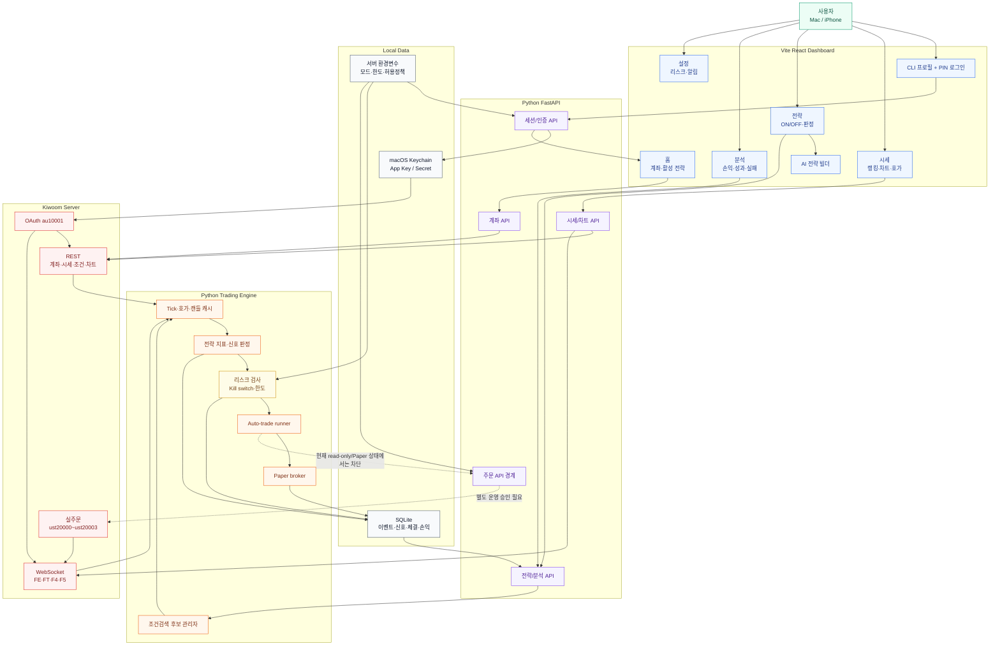
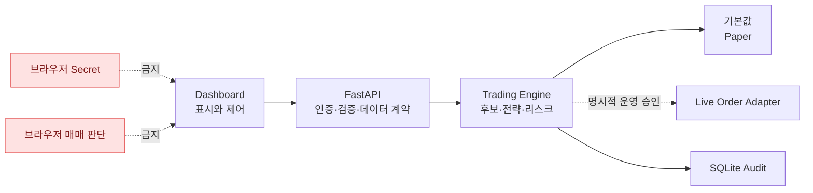

# Strategy Pilot V2 System Map

## 전체 지도

## 새 버전의 핵심 경계

## V2 권장 제작 순서

| 단계 | 결과물 | 완료 기준 |
| ---: | --- | --- |
| 1 | 현재 자산 동결/분류 | 재사용·폐기·보류 목록 확정 |
| 2 | 단일 API 계약 | 화면별 응답 schema와 오류 형식 확정 |
| 3 | 데이터 모델 정리 | 계좌·시세·전략·주문 이벤트 모델 확정 |
| 4 | 대시보드 재구성 | 5개 탭과 버튼 흐름 구현 |
| 5 | Paper runner 통합 | 전략 ON/OFF부터 Paper 체결/분석까지 연결 |
| 6 | 운영 안정화 | 재시작 복원, stale data 차단, 감사 로그 |
| 7 | 실주문 별도 승인 | 주문/체결/미체결/청산 검증 후 제한적으로 개방 |

## V2의 기본 원칙

- 브라우저는 Kiwoom API를 직접 호출하지 않는다.
- 거래 판단은 Python trading engine에서만 수행한다.
- 기본 실행은 read-only 또는 Paper이다.
- 실주문은 전략 ON/OFF와 분리된 서버 안전 게이트를 통과해야 한다.
- 모든 신호, 차단, 주문 시도, 체결, 손익을 재현할 수 있어야 한다.
- 실제 Secret, Token, 계좌번호, 원본 계좌 응답은 Git과 문서에 저장하지 않는다.
